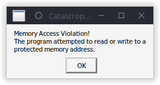

# SCP - Containment Breach Ultimate Edition Reborn and Multiplayer Reborn on Linux/SteamDeck with WINE/Proton

## IMPORTANT Note: Please Report any Issues with The Setup Guide directly to me, Not the UER Mod Devs. Only Report In-Game Bugs/Issues To The UER Devs.

.png)

## Their are 2 versions of SCP UER:
## Singleplayer ([modDB](https://www.moddb.com/mods/scp-containment-breach-ultimate-edition)) and Multiplayer ([Steam](https://store.steampowered.com/app/3257000/SCP_CB_Multiplayer_Reborn/))
**each version may vary in some steps, read the steps related to the version of the game you want to play on, carefully.**
#

# Step 1: Installation

## Multiplayer:

**[Steam Store](https://store.steampowered.com/app/3257000/SCP_CB_Multiplayer_Reborn/)** **> SCP: CB Multiplayer Reborn > Play Game > Install**

### For the Multiplayer Version (Steam) make sure "Proton" is enabled in your Settings on your Steam Client, After that you can skip on over to Step 2.

## Singleplayer:

**[modDB](https://www.moddb.com/mods/scp-containment-breach-ultimate-edition)** **> SCP - Containment Breach Ultimate Edition (Reborn) > Files > (Installer) > Download Now**

### then you need a Runner GUI for WINE like [Bottles](https://usebottles.com/download/) or [Lutris](https://lutris.net/), Both of which i recommend for ease of use

### Once the runner of your choice has been picked or already installed before, use the following steps for the runner your using
##
## Bottles: 
**click the "+" in The Top Left Corner to Create a Bottle > Pick Whatever Name You Want > Select "Gaming" > Create (This May Take a Few Moments) > "Run Executable" > Navigate to the directory where you downloaded the Installer > Run The Installer and follow its steps**

**Note for Bottles: You may have to hit "Browse" and select "C:" Drive during the installer for it to install sucessfully. You can also use the zip file but you add it as a "Shortcut" and navigate to the extracted folder of the game and then select the game executable as your shortcut**
##
## Lutris: 
**click the "+" in the Top Left Corner > "Install a Windows game from an executable > name it whatever you want > Install > Setup file install > Select Installation Directory (Remember where it is) > Continue > Select Setup File > "•••" > Navigate to the directory of your downloaded installer and select it > Follow the installers directions**

**Note for Lutris: You may have to hit "Browse" and select "C:" Drive during the installer for it to install sucessfully. You can also use the zip file but you  in the "Select File Setup" step, you would have navigate to the executable files directory and select the executable.**
##
# Step 2: Patching/Configuring the Options.ini file

### as you see when trying to launch the game you get a MAV

### Fear not, all we need to do is find the Options.ini and patch/configure it
##
## Multiplayer Version (Steam)

### add: Play Startup Videos=0 to "[Advanced]" in ".steam/steam/steamapps/compatdata/3257000/pfx/drive_c/users/steamuser/AppData/Roaming/scpcb-mr/Data/options.ini"

### Alternatively for the Steam Flatpak: ".var/app/com.valvesoftware.Steam/.steam/steam/steamapps/compatdata/3257000/pfx/drive_c/users/steamuser/AppData/Roaming/scpcb-mr/Data/options.ini"

### Once thats added to file and saved, launch the game, the game will be playable, for much smoother gameplay check out my 2nd guide: [getting dgVoodoo2 to work properly on WINE/Proton]()

##
## Singleplayer Version (modDB)

## Bottles:
**Bottles GUI > Three Vertical Dots > click folder inside rectangle icon > go up, out the game directory > users > steamuser > AppData > Roaming > scpcb-ue > Data > "Options.ini".**
**Open the "Options.ini" file with your Text Editor and Add: Play Startup Video=0 under "[Advanced]", save the file and exit.**

#
## Lutris:
**Lutris GUI > "Up Arrow" next to "Play" > Browse Files > drive_c > users > steamuser > AppData > Roaming > scpcb-ue > Data > "Options.ini".**
**Open the "Options.ini" file with your Text Editor and Add: Play Startup Video=0 under "[Advanced]", save the file and exit.**
##
# Once you launch the game it will now be playable, for smoother gameplay check out my 2nd guide: [getting dgVoodoo2 to work properly on WINE/Proton](https://github.com/MrBonely/SCP-UER-Linux-SteamDeck-Setup/blob/main/GUIDE2.md)

# [Credits](https://github.com/MrBonely/SCP-UER-Linux-SteamDeck-Setup/blob/main/CREDITS.md)
