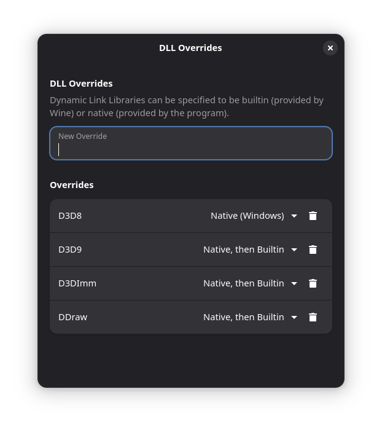
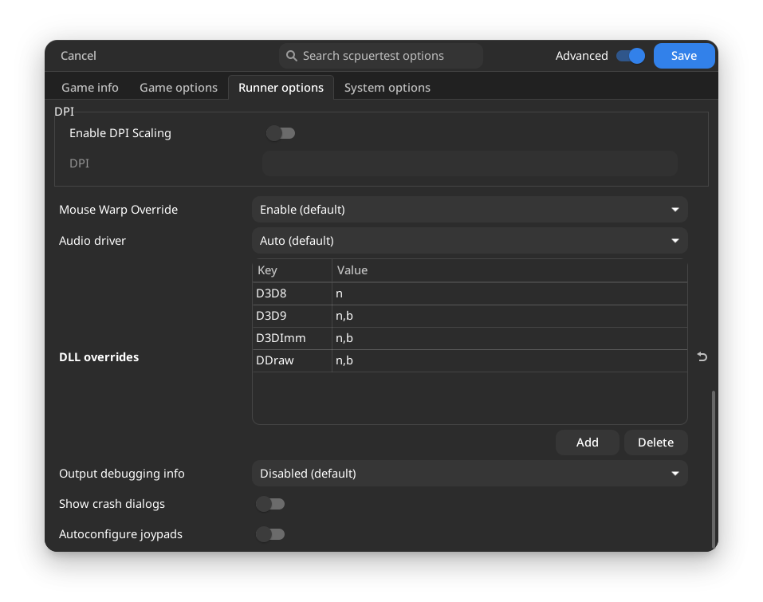

# SCP - Containment Breach Ultimate Edition Reborn and Multiplayer Reborn on Linux/SteamDeck with WINE/Proton, Plus dgVoodoo2

### First Guide is [right here](https://github.com/MrBonely/SCP-UER-Linux-SteamDeck-Setup/blob/main/GUIDE1.md), if needed or if have not read yet.

## IMPORTANT Note: Do NOT report any setup or wrapper issues to Dege (dgVoodoo2 Dev) as this is an older, unsupported version of dgVoodoo2, the last version to work on WINE/Proton. Only Report Issues with The Setup Guide directly to me, NOT Dege. 

.png)

#

# Step 1: Getting dgVoodoo2 (2.79-3) and removing any conflicting files/folders

**Older Builds of dgVoodoo2 are not that easy to come by, as they are usually deleted to reduce the amount of bugs reports/reggresions, we need 2.79-3 the last major version that works on WINE/Proton. But fortunately i have an [unmodified zip file of dgVoodoo2 (2.79-3) here on this repo to download](https://github.com/MrBonely/SCP-UER-Linux-SteamDeck-Setup/blob/main/dgVoodoo2zip/dgVoodoo2_79_3.zip).**

**Now that we have dgVoodoo2 2.79-3 downloaded we must remove the exsiting dgVoodoo2 folder that comes preinstalled in the games folder to prevent conflicts with the version were using.**

## Multiplayer Version (Steam):

**First: "Gear Icon" > "Manage" > "Browse Local Files" > Select "dgVoodoo" Folder and Delete/Move to Trash**

**Second (Optional but Recommended): Download this preconfigered dgVoodoo2 config optimized for this game on WINE/Proton, then place it into the directory of the executable for SCP UER**

**Third: Extract "dgVoodoo2_79_3.zip" > Open the extracted folder > Copy "dgVoodooCpl.exe" to game executable directory of SCP UERM > go to MS/x86 > Copy all 4 DLLS and place them in the directory of the executable file for SCP UERM**
#

## Singleplayer Version (modDB):

### Bottles:

**First: Three Vertical Dots > folder in rectangle icon > Select "dgVoodoo" Folder and Delete/Move to Trash**

**Second (Optional but Recommended): Download this preconfigered dgVoodoo2 config optimized for this game on WINE/Proton, then place it into the directory of the executable for SCP UER**

**Third: Extract "dgVoodoo2_79_3.zip" > Open the extracted folder > Copy "dgVoodooCpl.exe" to game executable directory of SCP UER > go to MS/x86 > Copy all 4 DLLS and place them in the directory of the executable file for SCP UER**
#

### Lutris: 
### IMPORTANT: DO NOT enable the built-in dgVoodoo2 setting, its currently bugged and it wont work well with UER.

**First: select UER you installed > click the "Up Arrow" next to "Play" > "Browse Files" > drive_c > "SCP - Containment Breach Ultimate Edition Reborn" > select "dgVoodoo" Folder and Delete/Move to Trash**

**Second (Optional but Recommended): Download this preconfigered dgVoodoo2 config optimized for this game on WINE/Proton, then place it into the directory of the executable for SCP UER**

**Third: Extract "dgVoodoo2_79_3.zip" > Open the extracted folder > Copy "dgVoodooCpl.exe" to game executable directory of SCP UER > go to MS/x86 > Copy all 4 DLLS and place them in the directory of the executable file for SCP UER**

# Step 2: Setting Up Paramenters/Overriding WINE DLLS

**Now with the first step done and now onto the final step, we have to setup DLL Overrides so WINE/Proton will the dgVoodoo2 DLLS in our Game/WINE Prefix.**

## Multiplayer (Steam):

**Properties > General > Long Gray Box known as "Launch Parameters"**
**Simply Add**: WINEDLLOVERRIDES="d3d9=n,b;d3d8=n;b,d3dimm=n,b;ddraw=n,b" %command% **to the games launch parameters and exit, now when you launch the UER Launcher, your GFX Driver Will Show Up as "dgVoodoo DirectX Wrapper" or the GPU you are using**

## Singleplayer (modDB):

### Bottles: 
**Open Bottles > Go to the Bottle of your UER installation > "Settings" > "Compatibility" > "DLL Overrides" > Set the Overrides as follows in the image below**
#

#
**once finished you may exit and when you open the UER Launcher, your GFX Driver Will Show Up as "dgVoodoo DirectX Wrapper" or the GPU you are using**
#

### Lutris: 
### IMPORTANT: Again, DO NOT enable the built-in dgVoodoo2 setting, its currently bugged and it wont work well with UER.

**Open Lutris > select UER > click the "Upper Arrow" next to "Play" > "Configure" > Runner Options > Go Down to "Dll Overrides" and enter as follows in the image below**
#

#
**once saved you may exit and when you open the UER Launcher, your GFX Driver Will Show Up as "dgVoodoo DirectX Wrapper" or the GPU you are using**
#

# [Credits](https://github.com/MrBonely/SCP-UER-Linux-SteamDeck-Setup/blob/main/CREDITS.md)